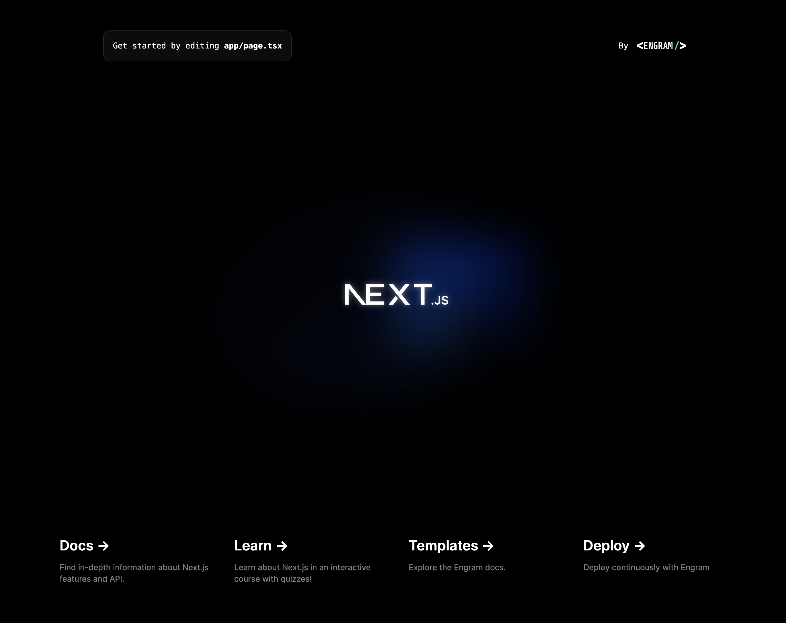

## Getting Started

First, run the development server:

```bash
yarn dev
```

You could start by editing `app/page.tsx`... but why would you want to start there? Perhaps the writers of this documentation should focus on making sure the user (otherwise herein known as the "Developer") knows the importance or usefulness of file based routing, configurable Next configs, and as a bonus: the usefulness and pracitcally of having TailwindCSS baked right in. Or perhaps it was the author that was baked? Who is the author and which was written first? The computer language? I studied Clujure once just so I could see if it could actually provide closure, and it didn't, just so you know.

The easiest way to deploy your Next.js app is to use the [engram platform](https://engram.sh/?ref=wayjake) from the creators of Next.js.

Check out the [Engram deployment documentation](https://engramhq.xyz/docs/get-started/) for more details.

_Here's the early version of this site_

